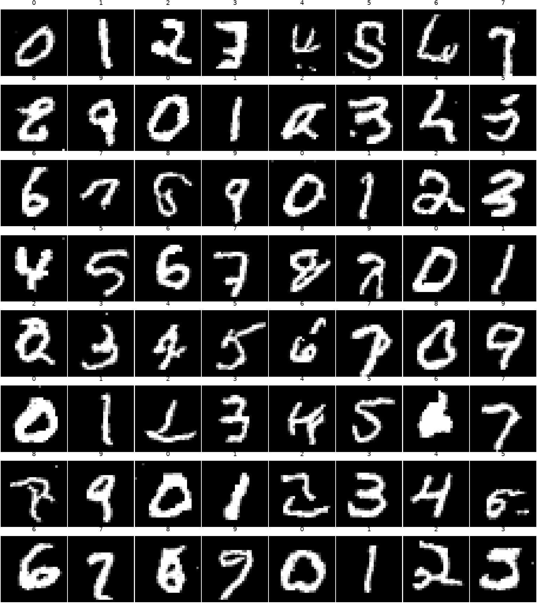
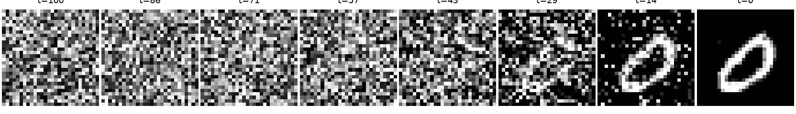
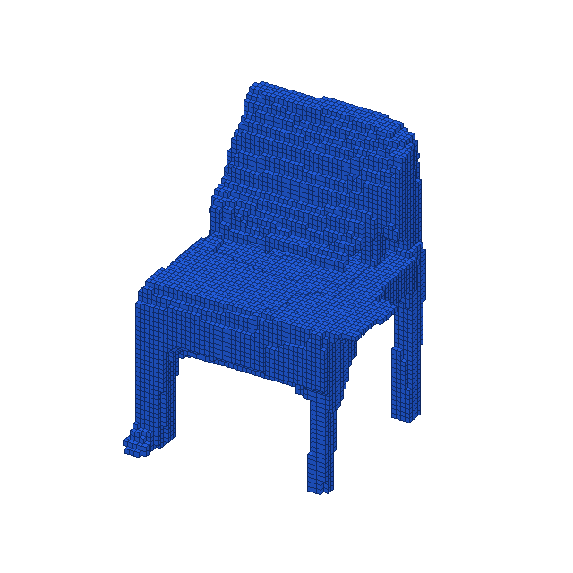
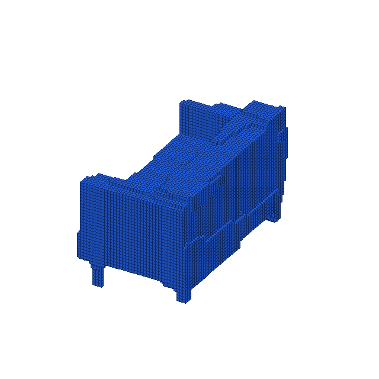
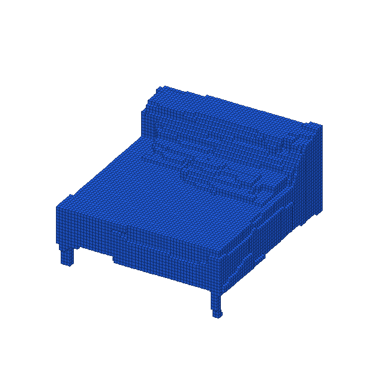
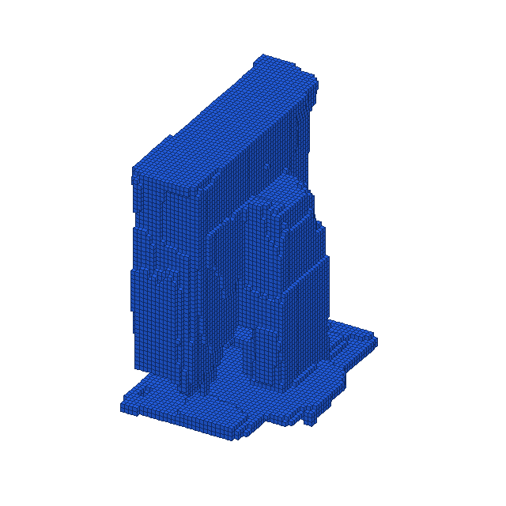

# Discrete Diffusion Demo

<p align="right">
English | <a href="README.zh-CN.md">中文</a>
</p>

A compact PyTorch implementation of conditional categorical diffusion, demonstrated on quantized MNIST images and binary ModelNet10 voxel grids.

```text
discrete data -> categorical corruption -> neural clean-token prediction -> exact discrete reverse chain -> generated sample
```

Unlike Gaussian diffusion, every state in this project is a categorical token. Images remain quantized intensities and voxels remain empty/occupied values throughout the forward and reverse processes.

For environment setup, data preparation, training, sampling, animation, and output paths, see [Documentation](Documentation/README.md).

## The Idea

Let each site of a sample take one of `K` values. A diffusion step either preserves its token or replaces it through a uniform categorical transition:

```math
Q_t = (1-\beta_t)I + \beta_t U,
\qquad
U_{ij}=\frac{1}{K}.
```

For MNIST, one site is a quantized pixel and `K=32`. For ModelNet10, one site is a voxel and `K=2`, corresponding to empty and occupied space. The same diffusion engine therefore applies to both experiments without converting the data to continuous noise.

## The Forward Categorical Path

The transition matrices compose exactly:

```math
\bar Q_t = Q_1 Q_2 \cdots Q_t,
\qquad
q(x_t\mid x_0)=\operatorname{Cat}(x_0\bar Q_t).
```

As `t` increases, the clean token is progressively forgotten and the marginal approaches the uniform categorical distribution. Sampling `x_t` therefore requires one matrix lookup and a categorical draw rather than simulating every earlier step.

This construction is implemented in [`src/ddiff/diffusion/categorical.py`](src/ddiff/diffusion/categorical.py).

## The Training Objective

The denoiser receives a corrupted sample, its timestep, and an optional conditioning label. It predicts clean-token logits independently at every spatial site while sharing context through a CNN or 3D U-Net:

```math
p_\theta(x_0\mid x_t,t,y)
=\operatorname{softmax}\bigl(f_\theta(x_t,t,y)\bigr).
```

Training draws a random timestep and minimizes clean-token cross entropy:

```math
\mathcal L(\theta)
=\mathbb E_{x_0,t,x_t}
\left[-\sum_n w_{x_{0,n}}
\log p_\theta(x_{0,n}\mid x_t,t,y)\right].
```

The voxel experiment uses a moderate occupied-token weight to retain thin structures without strongly biasing uncertain boundaries toward occupancy. The loss wrapper lives in [`src/ddiff/diffusion/categorical.py`](src/ddiff/diffusion/categorical.py), and the training loop, EMA update, cosine schedule, and validation-based checkpoint selection live in [`src/ddiff/train.py`](src/ddiff/train.py).

## Reverse Sampling

Generation starts from uniform categorical noise. The model's clean-token distribution is combined with the exact categorical posterior at every reverse step:

```math
p_\theta(x_{t-1}\mid x_t,t,y)
=\sum_{\hat x_0}
q(x_{t-1}\mid x_t,\hat x_0)
p_\theta(\hat x_0\mid x_t,t,y),
```

where

```math
q(x_{t-1}=i\mid x_t=j,x_0=k)
=\frac{Q_t[i,j]\,\bar Q_{t-1}[k,i]}
{\bar Q_t[k,j]}.
```

Iterating this distribution from `T` to `0` turns discrete noise into a sample while preserving categorical states at every step. The sampler is implemented in [`src/ddiff/diffusion/categorical.py`](src/ddiff/diffusion/categorical.py), with dataset-level label handling and output serialization in [`src/ddiff/sample.py`](src/ddiff/sample.py).

## Relation to Gaussian Diffusion

| Method | State space | Forward corruption | Model prediction | Reverse update |
| --- | --- | --- | --- | --- |
| Gaussian diffusion | Continuous | Add Gaussian noise | Noise, score, or clean data | Gaussian transition |
| This demo | Finite categorical | Multiply by `Q_t` | Clean-token logits | Exact categorical posterior |

The conceptual structure is the same—destroy information, learn to recover it, then reverse the path—but the probability model matches the discrete data directly.

## Inside This Demo

| Experiment | Representation | Denoiser | Conditioning | Output |
| --- | --- | --- | --- | --- |
| MNIST | `28 x 28`, 32 intensity tokens | Residual `CNN2D` | Digit class `0..9` | Quantized digit image |
| ModelNet10 | `64 x 64 x 64`, binary occupancy | Residual `UNet3D` | Learned geometric subtype | Voxel object |

The MNIST model is in [`src/ddiff/models/cnn2d.py`](src/ddiff/models/cnn2d.py). The voxel model is in [`src/ddiff/models/unet3d.py`](src/ddiff/models/unet3d.py). Both inject timestep and label embeddings into residual blocks, then emit one logit channel per categorical value.

For ModelNet10, meshes are normalized and voxelized, a supervised 3D classifier provides shape embeddings, and per-class clustering produces readable subtype conditions such as `chair_0` and `sofa_2`. Disconnected floating fragments are removed after sampling; this cleanup does not alter the learned reverse process.

## Results

### Quantized MNIST

Class-conditioned samples cover all ten digit labels while remaining on the 32-level discrete intensity grid.



The reverse chain exposes the transition from categorical noise to a clean digit.



### ModelNet10 Voxels

The same diffusion core generates binary `64^3` occupancy grids. These examples show four conditioned geometric subtypes after connected-component cleanup.

<table>
  <tr>
    <td align="center"><br>chair_0</td>
    <td align="center"><br>sofa_2</td>
  </tr>
  <tr>
    <td align="center"><br>bed_0</td>
    <td align="center"><br>monitor_1</td>
  </tr>
</table>

## Takeaway

Discrete diffusion keeps the probabilistic model in the same state space as the data:

```math
q(x_t\mid x_0)=\operatorname{Cat}(x_0\bar Q_t),
\qquad
p_\theta(x_0\mid x_t,t,y)=\operatorname{softmax}(f_\theta(x_t,t,y)).
```

One categorical engine can therefore support both quantized 2D images and binary 3D geometry; only the representation, denoiser, and conditioning signal change.
