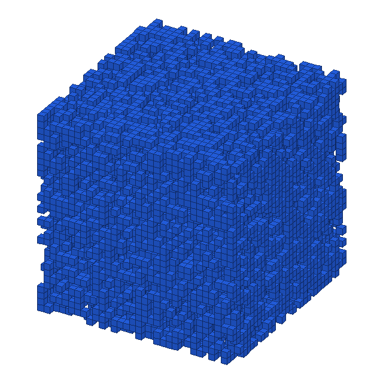
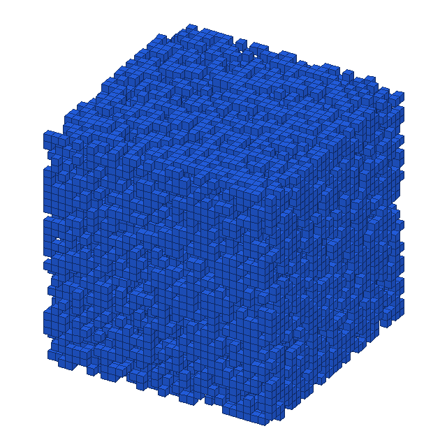

# 离散扩散模型演示

<p align="right">
<a href="README.md">English</a> | 中文
</p>

这里实现了一套条件离散扩散模型。同一个扩散核心既可以生成量化后的 MNIST 图像，也可以生成 ModelNet10 的二值体素模型。

```text
离散数据 -> 类别转移逐步破坏信息 -> 神经网络预测原始取值 -> 精确离散后验反推 -> 生成样本
```

整个过程中，数据始终由离散取值（token）组成：像素不会被换成连续高斯噪声，体素也一直只有“空”和“占用”两种状态。

环境安装、数据准备、训练、采样、动画和输出目录等操作说明统一放在 [Documentation](Documentation/README.md)。

## 直觉

假设每个位置只能取 `K` 个类别之一。前向扩散的每一步，要么保留原来的取值，要么按照均匀类别分布重新采样：

```math
Q_t=(1-\beta_t)I+\beta_t U,
\qquad
U_{ij}=\frac{1}{K}.
```

对 MNIST 来说，一个位置就是量化像素，共有 32 种灰度；对 ModelNet10 来说，一个位置就是体素，只有空和占用两种可能。虽然表示不同，二者都可以交给同一套离散马尔可夫过程处理。

## 前向过程如何加噪

离散转移矩阵可以直接连乘：

```math
\bar Q_t=Q_1Q_2\cdots Q_t,
\qquad
q(x_t\mid x_0)=\mathrm{Cat}(x_0\bar Q_t).
```

随着 `t` 增大，当前位置与原始取值的关系越来越弱，最后趋近均匀类别分布。有了累计矩阵 `\bar Q_t`，训练时可以直接从干净样本采出任意时刻的 `x_t`，不必真的把此前所有加噪步骤逐一执行一遍。

这部分实现在 [`src/ddiff/diffusion/categorical.py`](src/ddiff/diffusion/categorical.py)。

## 训练到底在学什么

网络接收被扰动的 `x_t`、时间 `t` 和可选的条件标签 `y`，并为每个空间位置预测原始取值的类别分布：

```math
p_\theta(x_0\mid x_t,t,y)
=\mathrm{softmax}\bigl(f_\theta(x_t,t,y)\bigr).
```

训练时随机选择一个时间步，并最小化干净取值的交叉熵：

```math
\mathcal L(\theta)
=\mathbb E_{x_0,t,x_t}
\left[-\sum_n w_{x_{0,n}}
\log p_\theta(x_{0,n}\mid x_t,t,y)\right].
```

体素数据中的“空”远多于“占用”；但如果给占用类别过高的权重，物体边界又容易长出多余体素。这里采用较温和的占用权重，在保留椅腿等细结构和维持清晰边界之间做折中。损失函数封装在 [`src/ddiff/diffusion/categorical.py`](src/ddiff/diffusion/categorical.py)，训练循环、EMA、余弦学习率以及最佳检查点的选择都在 [`src/ddiff/train.py`](src/ddiff/train.py) 中。

## 怎么从噪声生成样本

采样从均匀的类别噪声开始。每一步都会把网络预测的干净取值分布与已知的离散后验结合起来：

```math
p_\theta(x_{t-1}\mid x_t,t,y)
=\sum_{\hat x_0}
q(x_{t-1}\mid x_t,\hat x_0)
p_\theta(\hat x_0\mid x_t,t,y),
```

其中离散后验可以精确计算：

```math
q(x_{t-1}=i\mid x_t=j,x_0=k)
=\frac{Q_t[i,j]\,\bar Q_{t-1}[k,i]}
{\bar Q_t[k,j]}.
```

从 `T` 反复更新到 `0`，起初随机的离散取值便逐渐组成有结构的图像或体素。核心采样器仍在 [`src/ddiff/diffusion/categorical.py`](src/ddiff/diffusion/categorical.py)，标签解析和结果保存则由 [`src/ddiff/sample.py`](src/ddiff/sample.py) 负责。

## 实验设置

| 实验 | 数据表示 | 去噪网络 | 条件 | 生成结果 |
| --- | --- | --- | --- | --- |
| MNIST | `28 x 28`，32 级离散灰度 | 残差 `CNN2D` | 数字类别 `0..9` | 量化数字图像 |
| ModelNet10 | `64 x 64 x 64`，二值占用 | 残差 `UNet3D` | 聚类得到的几何子类型 | 三维体素模型 |

MNIST 网络位于 [`src/ddiff/models/cnn2d.py`](src/ddiff/models/cnn2d.py)，体素网络位于 [`src/ddiff/models/unet3d.py`](src/ddiff/models/unet3d.py)。两者都会把时间嵌入和类别嵌入送入残差块，最后为每种离散取值输出一个 logit 通道。

ModelNet10 这条路径会先统一网格尺度并完成体素化，再用有监督的 3D 分类器提取几何特征，最后在每个原始类别中聚类出 `chair_0`、`sofa_2` 等子类型。采样后的最大连通分量过滤只负责清除漂浮碎片，不属于扩散过程本身。

## 和高斯扩散有什么不同

| 方法 | 状态空间 | 前向破坏 | 网络预测 | 反向更新 |
| --- | --- | --- | --- | --- |
| 高斯扩散 | 连续值 | 加高斯噪声 | 噪声、score 或干净数据 | 高斯转移 |
| 这份实现 | 有限类别 | 乘以类别转移矩阵 `Q_t` | 干净取值的 logits | 精确类别后验 |

两者的思路相同：先逐步抹掉信息，再学习怎样反向恢复。区别在于，这里从头到尾都使用与数据类型匹配的离散概率模型。

## 结果展示

### 量化 MNIST

条件采样覆盖 0 到 9 十个数字类别，所有像素也始终取自 32 级离散灰度。


下面的反向链展示了类别噪声如何逐渐收敛为清晰数字。


### ModelNet10 体素

同一个扩散核心也能生成二值 `64^3` 占用网格。下面四个动画都从类别噪声开始，最终得到经过连通分量清理的物体，分别对应四种条件子类型。

<table>
  <tr>
    <td align="center"><br>chair_0</td>
    <td align="center"><br>sofa_2</td>
  </tr>
  <tr>
    <td align="center"><br>bed_0</td>
    <td align="center"><br>monitor_1</td>
  </tr>
</table>

## 总结

离散扩散的关键，是让概率模型和数据共享同一个状态空间：

```math
q(x_t\mid x_0)=\mathrm{Cat}(x_0\bar Q_t),
\qquad
p_\theta(x_0\mid x_t,t,y)=\mathrm{softmax}(f_\theta(x_t,t,y)).
```

因此，同一套离散扩散核心可以同时处理量化二维图像和二值三维几何；需要随任务变化的，只有数据表示、去噪网络和条件信号。
